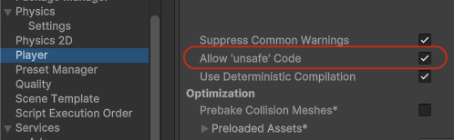
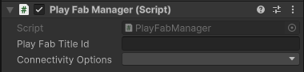
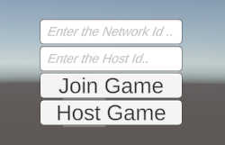
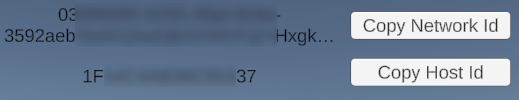

# Playfab Integration Sample

A sample integration for the **PlayFab Party Transport** and **coherence** networking for player-hosted servers.

ℹ️ **Download a release that matches the installed coherence SDK version to at least MAJOR.MINOR. For example, if you are using SDK v1.0.5 (MAJOR = 1, MINOR = 0), use [v1.0.0](https://github.com/coherence/coherence-azure-playfab/releases/tag/v1.0.0). Check the list of [releases](https://github.com/coherence/coherence-azure-playfab/releases) on this repository.**

## How does it work

The **PlayFab Integration** is using a combination of the PlayFab relay servers and an implementation of `ICoherenceRelay` to enable PlayFab users to connect and play with each other while avoiding NAT issues.
The `ICoherenceRelay` implementation allows for users to connect to the hosting client through PlayFab, and have the client forward their data packets to the user-hosted Replication Server.

## Components

- `PlayFabManager` will initialize the PlayFabSDK and manage the joining and hosting of self-hosted servers.
- `PlayfabConnectionUI` is a simple sample for hosting and joining accessibility, that will provide a UI allowing you to join or host a game. On connection the UI shows the host and network IDs that can be copied to the clipboard.

## How to use in your own project

1. In Project Settings > Player, check the "Allow 'unsafe' Code" tick box. The PlayFab Party SDK requires unsafe code to function.

    
1. Install the [PlayFab Party SDK](https://learn.microsoft.com/en-us/gaming/playfab/features/multiplayer/networking/party-sdks) Unity Package using the instructions on the page to install the correct version for your platform. This package includes the "PlayFabSDK".
1. In the scene containing your CoherenceBridge GameObject/Component, drag and drop the "PlayFabMultiplayerManager" prefab from the "Assets/PlayFabPartySDK/Prefabs" folder onto the scene.
1. Copy the "PlayFabSample" folder into your own project.
1. In the scene containing your CoherenceBridge GameObject/Component, create a new GameObject with the `PlayFabManager` Component from the "PlayFabSample" folder.
1. Use the Inspector with the `PlayFabManager` to set the Play Fab Title Id to the Id of your project.

    
1. (Optional) Add the "PlayfabConnectionUI" prefab to the scene from the "Assets/PlayFabSample/Prefabs" folder. If you don't have an Event System in your scene, create one by clicking Game Object > UI > Event System on the Unity menu bar. The UI can be used to host or join a game. After joining a game the Host and Network IDs are shown and can be copied to the clipboard.

    

    

